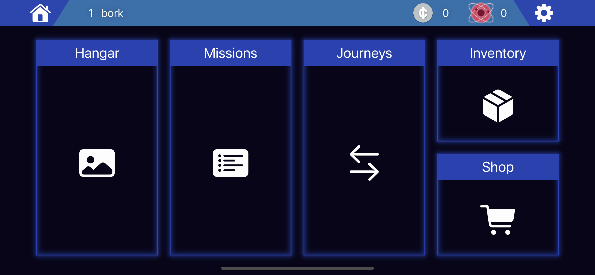
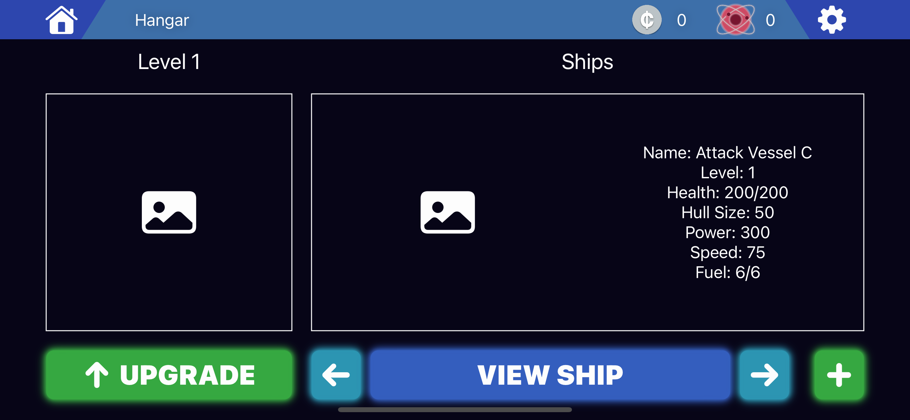
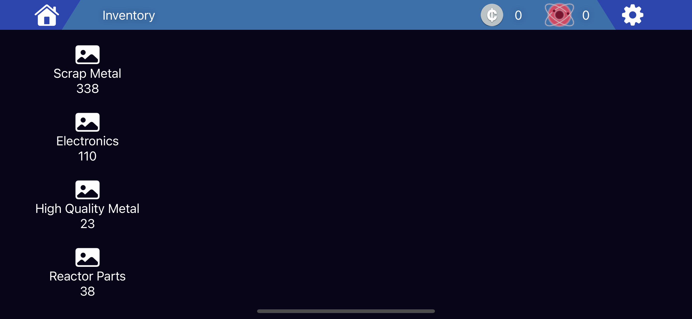

# swift-space-merchant
WIP.
A simple mobile game written entirely in Swift, using SwiftUI for the GUI. This was created for my final-year university project. The code isn't perfect, and the game is missing features that I wish it had, but I did what I could under the time constraints of the coursework.

## Design
I am quite happy with how the front-end turned out, considering it is written completely in code and looks very similar to the [initial designs](DESIGN.md) I did in Sketch. Although, there is still work to be done to parts of the front-end once the functionality of the game is complete.
### UI Screenshots

